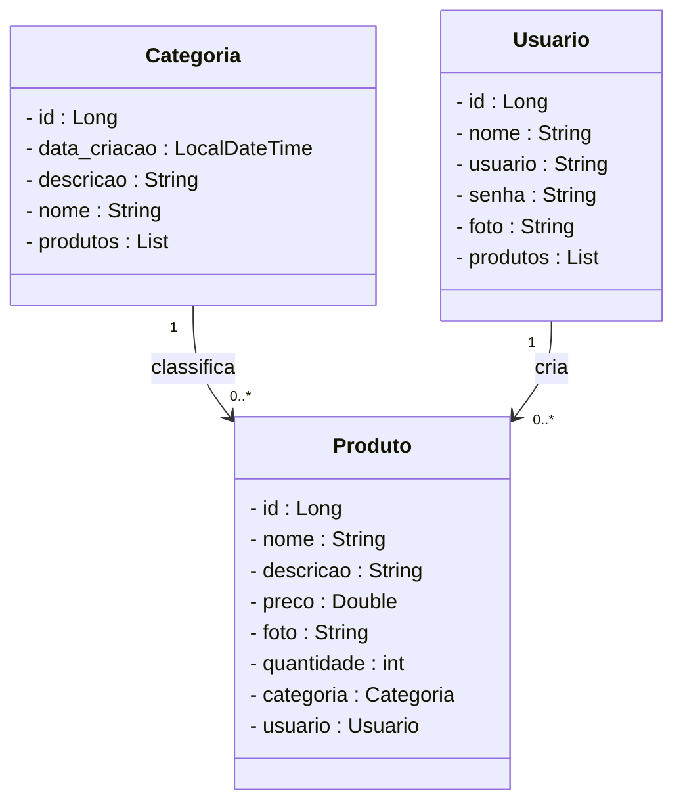
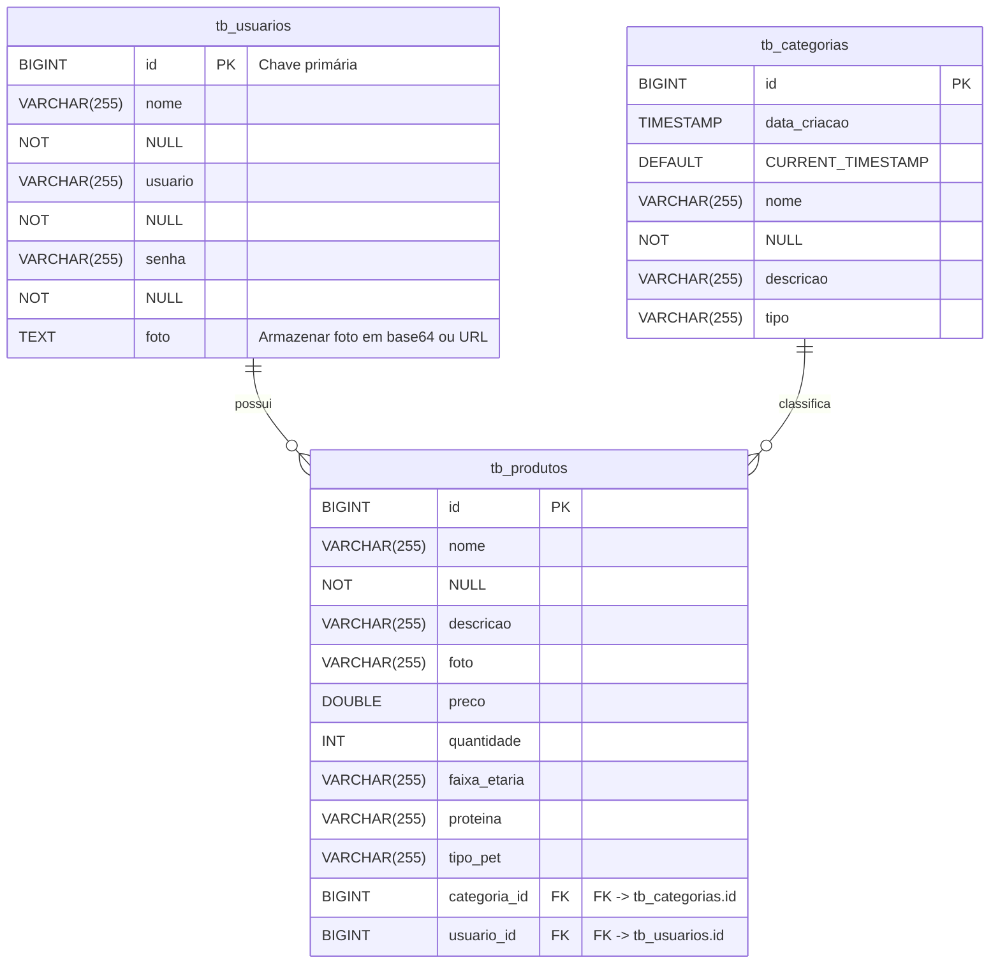

# 🐾 InovaPet – Comidinha Boa - Backend

**Alimentação natural e personalizada para cães e gatos, entregue diretamente na porta do seu pet**

---

## 🧩 Sobre o Projeto   <br />
<div align="center">
    
</div>


<br /><br />

O **InovaPet – Comidinha Boa** é uma plataforma que conecta tutores de pets a produtores e marcas de alimentação natural, oferecendo refeições frescas, saudáveis, personalizadas para cães e gatos e entrega rápida.  
Todas as refeições são formuladas por **nutricionistas veterinários** e preparadas com **ingredientes selecionados de produtores locais**.

---
## 👥 Equipe

<table align="center">
  <tr>
    <td align="center">
      <a href="https://github.com/stellabrumatti">
        <br>
        <b>Stella</b><br>
        <sub>Scrum Master</sub>
      </a>
    </td>
    <td align="center">
      <a href="https://github.com/nayarakiyota">
        <br>
        <b>Nayara</b><br>
        <sub>Tester</sub>
      </a>
    </td>
    <td align="center">
      <a href="https://github.com/MarciaCondarco">
        <br>
        <b>Marcia</b><br>
        <sub>Desenvolvedora</sub>
      </a>
    </td>
    <td align="center">
      <a href="https://github.com/jmcardoso18">
        <br>
        <b>Jamila</b><br>
        <sub>Desenvolvedora</sub>
      </a>
    </td>
    <td align="center">
      <a href="https://github.com/lauhgabrielle14">
        <br>
        <b>Lauren</b><br>
        <sub>Desenvolvedora</sub>
      </a>
    </td>
    <td align="center">
      <a href="https://github.com/patriciaEliseu">
        <br>
        <b>Patricia</b><br>
        <sub>Desenvolvedora</sub>
      </a>
    </td>
  </tr>
</table>

## 🩺 Problema
Nos centros urbanos, muitos pets sofrem com problemas de saúde devido à alimentação inadequada.  
Tutores enfrentam dificuldade em encontrar opções **nutritivas, confiáveis e personalizadas**.

---

## 💡 Solução
O InovaPet fornece **refeições frescas, balanceadas e personalizadas** via aplicativo, com:

- Catalogo de refeições naturais
- Agendamento de entregas

### 🔑 Diferenciais
- **Personalização inteligente** (idade, raça, peso e necessidades do pet);  
- **Impacto positivo** (apoio a produtores locais e práticas sustentáveis).

---

## 📊 Dados do Mercado
- Crescimento anual: **+23%** no segmento de alimentação premium pet no Brasil;  
- Tutores dispostos a investir até **35% mais** em produtos saudáveis;  
- Apenas **12% dos tutores** têm acesso a alimentos personalizados.

> O InovaPet se destaca como uma oportunidade real em um mercado em expansão.

---

## ⚙️ Funcionalidades Principais
| Entidade  | Ações disponíveis                                                                 |
|------------|-----------------------------------------------------------------------------------|
| **Categoria** | - Listar todos<br>- Consultar por ID<br>- Consultar descrição<br>- Consultar por período de criação |
| **Produto**    | - Listar todos<br>- Consultar por ID<br>- Consultar por nome<br>- Consultar por recomendação |
| **Usuário**    | - Listar todos<br>- Consultar por ID<br>- Consultar por nome |

---

## 🧱 Arquitetura do Sistema
### Diagramas de Classe



### Diagrama Entidade Relacionamento




## 🛠️ Tecnologias Utilizadas
- **Backend:** Spring Boot  
- **Banco de Dados:** MySQL  
- **Testes de API:** Insomnia  
- **Controle de Versão:** Git / GitHub  

---

## 🚀 Instalação e Execução

### Pré-requisitos
- Java 17+  
- Maven (ou utilizar `mvnw`)  
- MySQL  

### Passos
```bash
# Clonar o repositório
git clone <URL do repositório>

# Configurar o banco de dados
spring.datasource.url=jdbc:mysql://localhost:8080/inovapet
spring.datasource.username=root
spring.datasource.password=senha

# Rodar o projeto
./mvnw spring-boot:run
```

---

## 🔗 Endpoints Principais

### Categoria
- Listar todos  
- Consultar por ID ou Descrição  
- Criar / Atualizar / Deletar  

### Produto
- Listar todos  
- Consultar por ID ou Nome  
- Criar / Atualizar / Deletar  

### Usuário
- Listar todos  
- Consultar por ID  
- Cadastrar / Atualizar / Deletar  

---

## 🧪 Testes
Os testes foram realizados via **Insomnia**, validando os principais fluxos CRUD e respostas HTTP da API.

---

## ⚠️ Desafios Enfrentados
- Tratamento de datas e timezones;  
- Validação de entrada e integridade referencial;  
- Integração entre camadas e padronização das respostas.

---

## 🧭 Implementações Futuras
- Desenvolvimento da **interface web e mobile**;  
- Suporte veterinário;
- Histórico de saúde;  
- Assinatura recorrente;

---

## 📬 Contato
- ✉️ E-mail: **inovaher@outlook.com**  
- 🐙 GitHub: [github.com/InovaHer](https://github.com/InovaHer)

---

## 🖼️ Branding


```

```

---

## 📜 Licença
Projeto licenciado sob a **MIT License**.
